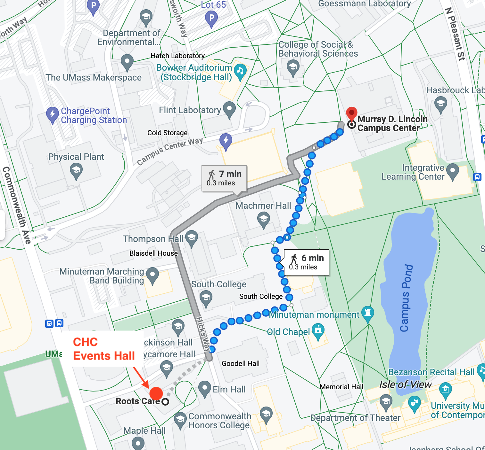
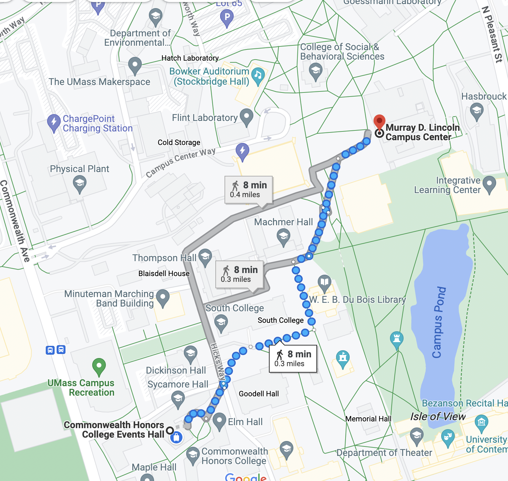

<a style="font-size:110%; font-weight: bold" href="assets/program.pdf">Link: Full program (pdf)</a>

Conference: November 9-10, 2023 at University of Massachusetts Amherst

The New Directions in Analyzing Text as Data (TADA) meeting is a leading forum for interdisciplinary research on the study of politics, society, and culture through computational analysis of documents. Recent advances in NLP have the potential to revolutionize how we study human society. But using these tools effectively, reliably, and equitably requires continuous dialog between experts across computational methods, social sciences, and the humanities. 

### Registration

We have a limited number of slots available for general public registration.
If you're interested, please register at [this link](https://umass.irisregistration.com/Form/TADA).

If you're at UMass and want to informally attend, we can let you sign up through a different process.  Ask us for a pointer if you haven't received it.

### Location

Conference events will be held at UMass Amherst, specifically at:

1. The [Commonwealth Honors College Events Hall, 157 Commonwealth Ave](https://maps.app.goo.gl/uRejRroGvgi7ktbe9).  It's a large room next to Roots Cafe.  Most sessions, including all talks, will be held here.   (Note there are multiple buildings associated with the CHC; go to the one that has Roots Cafe in it.)
2. The [Campus Center](https://maps.app.goo.gl/AmKDqGrUH8gP2cre6) Hotel (a.k.a. Hotel UMass), specifically the Amherst Room on the 10th floor.  Poster sessions, along with the Thursday afternoon cash bar and Friday breakfast, will be held here.

[Walking directions](https://goo.gl/maps/PcQKzJ1VMcjCapnc8) between them:

<!--

-->

### Schedule and Program

<a style="font-size:110%; font-weight: bold" href="assets/program.pdf">Link: Full program (pdf)</a>

#### Day 1: Thursday, November 9th

| *Time* | *Event* | *Location* |
| 8:00	| Breakfast | CHC Events Hall
| 9:00	| Opening Remarks | CHC Events Hall
| 9:15	| Panel 1 | CHC Events Hall
| 10:30	| Break | CHC Events Hall
| 10:45	| Roundtable | CHC Events Hall
| 12:00	| Lunch, including DC mentoring | CHC Events Hall
| 1:00	| Panel 2 | CHC Events Hall
| 2:15	| Break | CHC Events Hall
| 2:30	| Panel 3 | CHC Events Hall
| 3:45	| Break and move
| 4:15 | Poster Session 1 | Amherst Room, Campus Center
| 5:15	| End of the day |

#### Day 2: Friday, November 10th

| *Time* | *Event* | *Location* |
| 8:30	| Breakfast | Amherst Room, Campus Center
| 8:45	| Poster Session 2 | Amherst Room, Campus Center
| 9:45 | Break and move |
| 10:15 | Panel 4 | CHC Events Hall
| 11:30	| Break | CHC Events Hall
| 11:45	| Panel 5 | CHC Events Hall
|  1:00 | Closing Remarks & Lunch | CHC Events Hall

The main program ends at lunch.  

<!--
### Key Dates

- Submission deadline: **August 11th** (extended; orginally was Aug. 4)
- Notification of acceptance: Week of August 28th
- Registration opens: September 5th
- Papers circulated to discussants: October 26th
- Conference: November 9th and 10th
-->

### Poster presentation information

If your paper is being presented as a poster, there is no discussant and no paper draft needed (except, optionally, for doctoral consortium participants).

Poster format: We recommend posters be no larger than 36 inches tall by 48 inches wide.

We don't have on-site printing.  It's best to bring your poster.  Local printing options include Amherst Copy and Staples (you may need a car to access them).

If you have a scheduling constraint for when to present, please fill out [this form](https://docs.google.com/forms/d/e/1FAIpQLSdvPC3tNYyoRNL_FjVsr59e1MafcDTj_SiG8Hn_3WxlvoFyZQ/viewform?usp=sf_link).

### Abstract Submissions

TADA 2023 invites applications for research presentations on new work related to text-as-data methods and applications. Our programs from [past meetings](https://textasdata.github.io/events/) (e.g. [2022](https://tada2022.org/)) demonstrate this community's history of bringing together researchers, practitioners, and scholars from many fields.

Proposals to present work are due August 11, and consist of a brief, 300-word abstract in text format rather than a full paper.  TADA 2023 is a non-archival conference; there are no formal proceedings, and papers presented at the conference will not be distributed publicly by the conference. Presenters are expected to provide a paper to their discussant two weeks before the conference. We welcome any work, so long as it hasn't been previously presented at a TADA conference. We also welcome individuals to volunteer to serve as discussants.

[Link for submissions (inactive).](https://docs.google.com/forms/d/e/1FAIpQLSfpsWgM44dfn3HRrQVq3uGXstBvRN6rbuO8gJLchMVYApcaww/viewform?usp=sf_link)

### Doctoral Consortium and Broadening Participation

In addition to oral presentations and posters, TADA 2023 will have a doctoral consortium. We have limited funding to cover travel and lodging expenses for PhD students, who will be matched with experienced mentors from complementary fields to offer critiques to specific work and to provide guidance in how to do effective interdisciplinary work.

Additionally, there may be funding available to facilitate participation of attendees for whom it would be a financial burden.  If you would like to be considered for a registration waiver and/or travel funding, please indicate this on the submission.

Diversity leads to stronger science. We actively seek, welcome, and encourage people with diverse backgrounds, experiences, and identities to apply and attend. While many participants have attended TADA for years, we also eagerly welcome new researchers!

The conference organizers are committed to providing accessible and inclusive accommodations for participants. If you have any specific requirements or concerns, please reach out to the organizing committee in advance, and we will make every effort to accommodate your needs.

### Organization

Send questions for organizers at: <a href="mailto:info@tada2023.org">info@tada2023.org</a> (currently goes to Brendan and Doug).

Organizing Committee / Program Committee:
[Amber Boydstun](http://www.amber-boydstun.com/), [Michael Colaresi](http://michaelcolaresi.com/), [Justin Grimmer](https://www.justingrimmer.org/), [Justin Gross](http://justinhgross.com/), [Mohit Iyyer](https://people.cs.umass.edu/~miyyer/), [Katherine Keith](https://kakeith.github.io/), [David Mimno](https://mimno.infosci.cornell.edu/), [Brendan O’Connor](http://brenocon.com/), [Philip Resnik](http://users.umiacs.umd.edu/~resnik/), [Douglas Rice](http://douglas-rice.net/), [Kelsey Shoub](https://www.kelseyshoub.com/), [Brandon Stewart](https://scholar.princeton.edu/bstewart), [Laure Thompson](https://people.cs.umass.edu/~laurejt/), [Weiai Wayne Xu](https://curiositybits.cc/), [Leah Windsor](https://www.thewordwitch.dev/home)

Abstract reviews were performed double-blind by members of the program
committee, then discussed and selected to build the program.

TADA 2023 is gratefully supported by 
the National Science Foundation (grant [1845576](https://www.nsf.gov/awardsearch/showAward?AWD_ID=1845576)),
and at UMass,
the [Computational Social Science Institute](https://www.cssi.umass.edu/),
the [Data Analytics and Computational Social Science](https://www.umass.edu/social-sciences/academics/dacss) program,
the [Center for Data Science](https://ds.cs.umass.edu/),
and the [Manning College of Information & Computer Sciences](https://www.cics.umass.edu/).

### Logistics

#### Lodging
There is a block of rooms reserved for attendees on-campus at [Hotel UMass](https://hotelumass.com/); see information on the registration page.

Other local hotels include:
- [Courtyard by Marriott Hadley Amherst](https://www.marriott.com/en-us/hotels/bdlhd-courtyard-hadley-amherst/overview/?scid=f2ae0541-1279-4f24-b197-a979c79310b0); 423 Russell St., Hadley, MA 01035; (413) 256-5424.  Approximate Distance: 3 miles (6 minutes by car).
- [Homewood Suites by Hilton Hadley Amherst](https://www.hilton.com/en/hotels/bdlhahw-homewood-suites-hadley-amherst/?SEO_id=GMB-AMER-HW-BDLHAHW&y_source=1_MTIyMDc5NzEtNzE1LWxvY2F0aW9uLndlYnNpdGU%3D); 340 Russell St., Hadley, MA 01035; (413) 387-0583.  Approximate Distance: 3.5 miles (7 minutes by car).
- [Comfort Inn & Suites](https://www.choicehotels.com/massachusetts/hadley/comfort-inn-hotels/ma263?mc=llgoxxpx); 400 Russell St., Hadley, MA 01035; (413) 341-1556.  Approximate Distance: 3 miles (6 minutes by car).
- [Inn on Boltwood](https://www.innonboltwood.com/); 30 Boltwood Ave., Amherst, MA 01002; (413) 256-8200.  Approximate Distance: 1.7 miles (7 minutes by car).

#### Travel

 - If you are looking at airplane tickets, we strongly recommend Bradley (BDL), the airport at Hartford, Connecticut, which is much closer than Boston Logan (BOS).  
 - Rideshare apps are available in the area, though some users report there can be delays.
 - Buses ([Greyhound](https://www.greyhound.com/), [Peter Pan](https://peterpanbus.com/)) and trains ([Amtrak](https://www.amtrak.com/); see also [Trains In The Valley](https://trainsinthevalley.org/travel-options/)) may be an option, especially within the Northeast.  Northampton, MA and Springfield, MA are the closest train stations. Train connectivity is poor from Boston, but good from New York.
 - For more details, including shuttles and many other services, see [this CICS page, "Getting to Amherst"](https://www.cics.umass.edu/grads/arriving-amherst).

#### Parking

- You can park at the Campus Center Parking Garage (<a href="https://www.google.com/maps/place/1+Campus+Center+Way,+Amherst,+MA+01003/@42.3931482,-72.5328245,17z/">1 Campus Center Way</a>). The conference will have discounted parking tickets for registered conference attendees.
